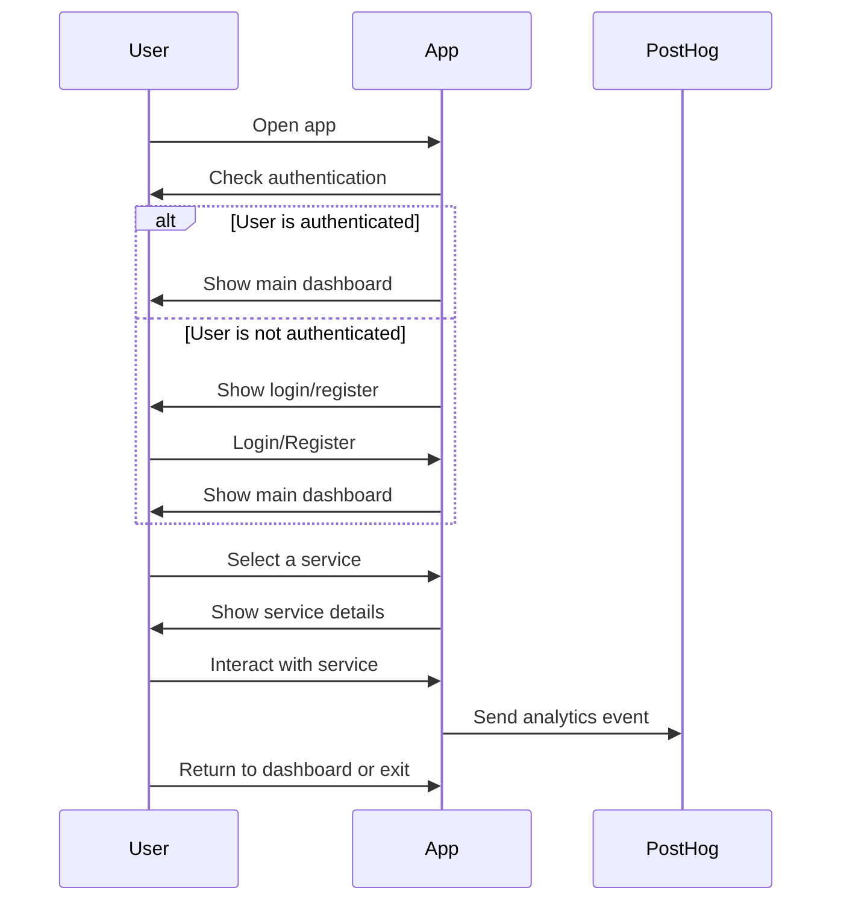

# PlacaOk 🚗

A modern cross-platform app for vehicle-related services, built with Expo, React Native, and PostHog analytics.

## 🚀 Getting Started

1. **Install dependencies**

   ```bash
   pnpm install
   ```

2. **Start the app locally**

   ```bash
   pnpm expo start
   ```

   Scan the QR code with Expo Go or open in an emulator/simulator.

## 🛠️ Remote Updates (OTA) with Expo

Expo supports over-the-air (OTA) updates, similar to CodePush.

- **Push an OTA update to the main branch:**
  ```bash
  pnpm eas-update
  ```

- **Push an OTA update to the preview branch:**
  ```bash
  pnpm eas-update:preview
  ```

## 🚚 Deploying to Expo Channels

- **Build for Android (preview profile):**
  ```bash
  pnpm eas-build:android:preview
  ```

- **Build for iOS (preview profile):**
  ```bash
  pnpm eas-build:ios:preview
  ```

- **Edit a channel to point to a specific branch:**
  ```bash
  pnpm eas-channel:edit:staging
  ```

## 🌐 Updating the `public/index.html` for Web Releases and APK Download

The `public/index.html` file serves as a landing page inviting users to download the latest APK. **Each time you release a new version, you must update the download link inside this file to point to the latest APK.**

**Steps:**
1. Edit `public/index.html` and update the APK download link to the latest release URL (e.g., from EAS Build output).
2. Optionally update version, meta tags, or other content as needed.
3. Commit your changes:
   ```bash
   git add public/index.html
   git commit -m "Update public/index.html with latest APK link for vX.Y.Z"
   git push
   ```
4. Deploy your web build as usual.

## 🤝 Collaboration

- **Branch naming:**  
  Use the pattern:  
  - `feature/<short-description>` for new features  
  - `fix/<short-description>` for bug fixes  
  - `chore/<short-description>` for maintenance  
  - `docs/<short-description>` for documentation updates

  Example:  
  ```
  feature/user-authentication
  fix/service-list-bug
  ```

- **Commit messages:**  
  Follow [Conventional Commits](https://www.conventionalcommits.org/) and use [commitlint](https://commitlint.js.org/).  
  Example:  
  ```
  feat: add user authentication flow
  fix: correct service list rendering bug
  ```

- **Pre-commit checks:**  
  This repo uses [lint-staged](https://github.com/okonet/lint-staged) and a pre-commit hook to ensure code quality.  
  - Staged files are automatically linted and formatted before commit.
  - If checks fail, the commit will be aborted.

- **How to contribute:**  
  1. Fork the repo and create a branch using the naming pattern above.
  2. Make your changes and commit using the commitlint rules.
  3. Push and open a Pull Request.
  4. Ensure all pre-commit checks pass.

## 📊 Analytics

All analytics are tracked with [PostHog](https://posthog.com/) (see `src/services/analytics.ts`).  
No magic strings—use constants for all event names and properties.

## 🧭 App User Flow




## 📚 Resources

- [Expo Documentation](https://docs.expo.dev/)
- [PostHog Docs](https://posthog.com/docs/libraries/react-native)
- [Expo Router](https://expo.github.io/router/docs/)

Happy coding! 🚀
