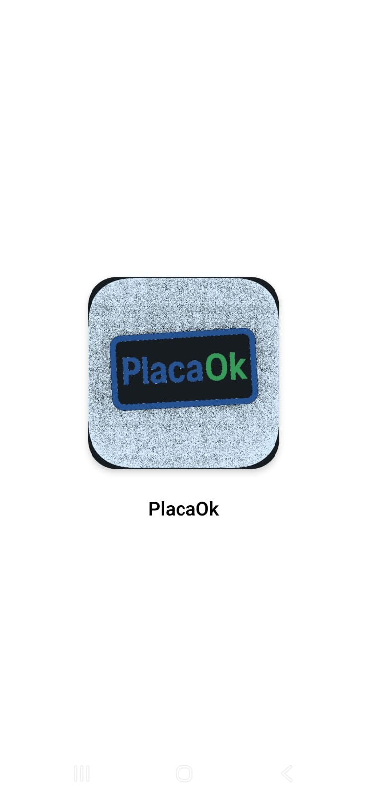
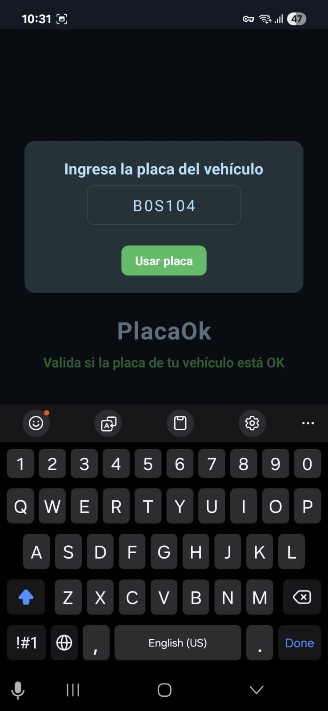
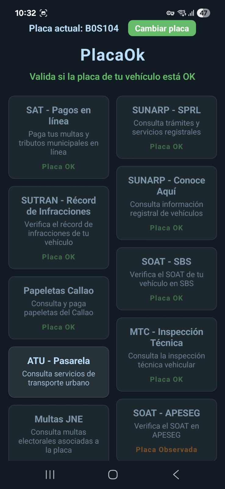
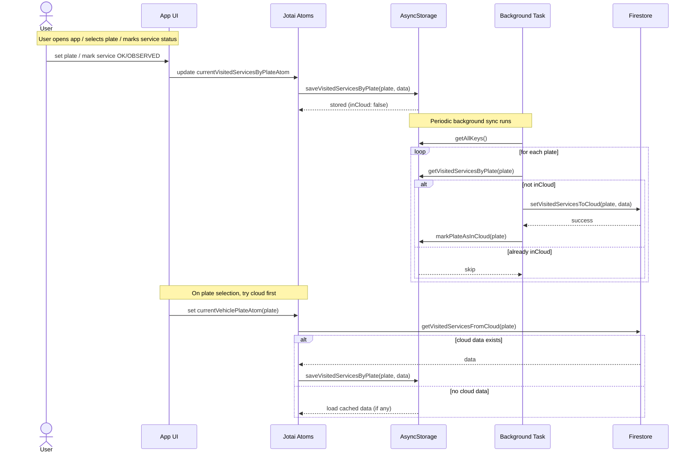

# PlacaOk 🚗🔎

- [Download on Google Play](https://play.google.com/store/apps/details?id=com.placaok)
- [Download on the App Store](https://apps.apple.com/app/idYOUR_APP_ID)

Discover services, verify plates, and check vehicle records in a single tap — now with a friendly Dark Mode (and good vibes). 😎

<!-- Horizontal scrollable image strip -->

	
	
	

## How AI Works

Inspired in this project: [Python License Plate Detection](https://github.com/Arijit1080/Licence-Plate-Detection-using-TensorFlow-Lite)

**Find services in a tap — fast tools, Dark Mode, zero fuss.**

Find services instantly — lightning-fast browsing, Dark Mode & in‑app webview 🧭

PlacaOk bundles all the vehicle-checking magic into one handy app. Need to verify a plate, check documents, look up tickets, confirm insurance (SOAT), or see owner history? Tap, scan, done. Fast UI, friendly layout, and privacy-minded analytics keep things smooth and worry-free.

What you get (quick):

- 🧰 All-in-one toolkit: plate lookup, document checks, license validation, ticket & debit status, owner history
- 🔍 Faster discovery: masonry-style grid so you find tools faster
- 🌐 Seamless browsing: in-app webview keeps you inside the app (no jumping around)
- 🌗 Dark + Light Mode: follows your device so reading is comfy
- 🔖 Visited indicators: know what you've already checked
- 🔒 Privacy-first: anonymous analytics only, no personal data shared

Why people ❤️ PlacaOk:

- Save time during inspections and verifications ⏱️
- Reduce mistakes by seeing consolidated records in one place ✅
- Make confident decisions with easy access to tickets, debits, and registry info

Download PlacaOk and start verifying in a tap — it’s quick, quiet, and helpful. 🎉

## Release notes

PlacaOk — Faster browsing & Dark Mode

Discover faster, browse smarter — now with Dark Mode. 🌙✨

- 🆕 Masonry-style service list for quicker scanning and better use of screen space
- 🆕 Open services in an in-app webview with an easy close button — no context switching
- 🆕 Dark and Light themes; follows your system for a consistent look
- 🆕 Visited-state indicators so you can tell which services you’ve already opened
- ⚡ UI polish and performance improvements across screens
- 🛠️ Bug fixes: multiple layout and stability fixes

## Contribute

Want to contribute or report a bug? Open an issue in the repo, include a sandbox — we read them! 🙌

What's next
-----------

Here's what's coming next for PlacaOk (and how you can help):

- 🔎 Improved search and filters — find exact services faster
- 🌍 Localization: Spanish and other languages for broader reach
- 📸 Plate OCR: snap a photo and auto-fill the plate field
- 🔔 Alerts & history: optional notifications for ticket/debt changes
- 🧪 Beta program: sign up to test upcoming features and provide feedback

## How we work ?

Author
------
[BinniCordova.com](https://BinniCordova.com)
